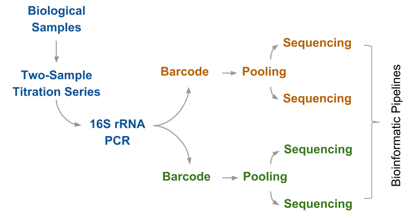

# Introduction
Microorganisms, the unseen majority, play an important role in environmental and human health.
Globally there are an estimated $4$ to $6 \times 10^{30}$ prokaryotic cells on earth  driving processes such as the carbon and nitrogen cycle [@whitman1998prokaryotes; @kallmeyer2012global; @whitman1998prokaryotes].
In the human body, bacterial cells are as abundant as human cells [@sender2016revised] and aid in fundamental processes such as digestion [@cho2012human; @young2017role].
The human gut microbiome has been linked to numerous diseases ranging from inflammatory bowel disease to autism [@cho2012human; @strati2017new].
Biotherapeutics, probiotics developed to treat disease, have the potential to revolutionize medicine and treat microbiome-linked diseases [@young2017role].
For example, fecal microbiome transplants have been successfully used to treat recalcitrant _Clostridium dificile_ infections [@rao2015fecal].
Accurately characterizating microbial communities is critical to successful biotherapeutics development.


Recent advances in deoxyribonucleic acid (DNA) sequencing technology has changed how we measure and thus study, microbiomes.
The two most commonly used methods to characterize microbial communities are shotgun metagenomics and 16S ribosomal ribonucleic acid (rRNA) marker-gene surveys  [@kuczynski2012experimental].
Shotgun metagenomics is the random sequencing of all genomic material in a sample.
16S rRNA marker-gene surveys use targeted sequencing to characterize community taxonomic composition.
There are benefits and disadvantage to both methods [@clooney2016comparing].
Shotgun sequencing is useful for functional information and strain-level analysis, whereas marker-gene sequencing provides a more complete view of the community composition.
Additionally, shotgun sequencing is significantly more expensive than marker-gene surveys and is, therefore, cost prohibitive for large cohort and global studies, such as the human microbiome project [@turnbaugh2007human] and earth microbiome project [@Thompson2017].
The focus of this dissertation is assessing 16S rRNA marker-gene survey methods.
However, the approaches presented apply to shotgun metagenomic method assessment as well.


## 16S rRNA Marker-Gene Surveys
Marker-gene survey data is used to characterize both organismal and community level differences [@Goodrich2014].
Differential abundance testing is a type of organismal level analysis used to identify organisms associated with specific treatment conditions, for example, a pathogen associated with a disease state.
Ecological diversity metrics are used to characterize microbial community richness and evenness within individual samples (alpha-diversity) and sample pairwise similarity (beta-diversity).


Marker-gene survey data is collected through a complex multi-step measurement process [@Goodrich2014].
The measurement process consists of numerous laboratory and computational steps.
Laboratory steps include DNA extraction, polymerase chain reaction (PCR), library preparation, and sequencing.
Computational steps include pre-processing, feature inference, feature annotation, and normalization.
See Sections \@ref(measurement-process) and \@ref(feature-inference-normalization) for a detailed description of the measurement processes.
Limitations in our understanding of the measurement process impede microbiome research.


## Measurement Assessment
Measurement assessment is used to characterize and validate the measurement process and as a result, advance microbiome research.
Results from marker-gene surveys indicate a potential connection between obesity and the gut microbiome [@ley2006microbial].
However, a meta-analysis combining data from multiple studies only found a weak association between obesity and the gut microbiome [@sze2016looking].
With a well-characterized measurement process we can better evaluate study conclusions.
In turn, reducing the identification of spurious associations, such as the ones identified by the obesity studies analyzed in the @sze2016looking meta-analysis.


A key component of measurement assessment is data with an expected value.
Common sources of data used to assess marker-gene surveys include computer simulated data (_in silco_), mixtures of DNA or cells from individual organisms (mock communities), and technical replicates of environmental samples.
_In silico_ data and mock communities provide expected values for use in assessment but do not recapitulate the complexity of environmental samples or the error profile of real sequencing data.
Without an expected value technical replicates are only suitable for method comparison.
Another data type, mixtures of environmental samples, provide the complexity of real data and an expected value for assessment.

## Dissertation Summary
In this dissertation, I will present a framework for 16S rRNA marker-gene survey measurement assessment using a novel mixture dataset along with software to facilitate working with 16S rRNA marker-gene survey data.
Chapter \@ref(measurement-process-assessment) provides an overview of the 16S rRNA sequencing measurement process and assessment.
Chapters \@ref(count-table) and \@ref(diversity-assessment-chpt) utilize a two-sample titration assessment dataset that I generated for this disseration (Fig. \@ref(fig:assessmentExperimentalDesign)).
In Chapter \@ref(count-table) my assessment framework was used to evaluate the relative and differential abundance values for count tables generated using different bioinformatic pipelines.
For Chapter \@ref(diversity-assessment-chpt) I developed methods to assess beta-diversity.
I then used the methods to evaluate the impact of sequencing artifacts on bioinformatic pipelines and normalization methods.
Finally, Chapter \@ref(metagenomefeatures-chpt)  describes the Bioconductor R package, _metagenomeFeatures_, I developed for working with 16S rRNA marker-gene survey data and 16S rRNA databases.
The assessment framework and software along with the assessment study results presented here will facilitate the development of improved computational methods and advance our understanding of the marker-gene survey measurement process.
The last three sections of this chapter provide a brief overview of the three main disseration chapters.


```{r assessmentExperimentalDesign, echo = FALSE, fig.cap = "Assessment dataset experimental design flowchart. Two-sample titration series were generated using DNA from stool samples collected as part of an Enterotoxigenic _Escherichia coli_ (ETEC) vaccine trial. The titration end point samples were selected as the initial sampling timepoint in the vaccine trial and timepoint after exposure with the highest measured concentration of ETEC. The assessment dataset includes multiple biological factors and technical replicates enabling the charaterization of multiple sources of bias and dispersion in the measurement process.The assessment dataset includes samples from five subjects, vaccine trial participants, with a two-sample titration series for each subject. Four 16S rRNA PCR replicates per titration series sample. The PCR assays were split into technical replicates and sent to two laboratories for library preparation and sequencing. Libraries were sequenced twice as each laboratory for a total of four sequence datasets.",fig.scap= "Two-sample titration assessment dataset experimental design."}

```


### Count Table Assessment
Proper measurement method evaluation allows for the characterization of individual steps impact on the measurement processes as a whole and determine where to focus efforts for improving the measurement process.
Appropriate datasets and methods are needed to evaluate the 16S rRNA marker-gene-survey measurement process.
Numerous studies have qualitatively and quantitatively assessed the 16S rRNA measurement process using mock communities, simulated data, and environmental samples.


Qualitative characterisitcs are commonly assessed using mock communities  [@bokulich2016mockrobiota].
As the number of organisms in the mock community is known, the total number of features can be compared to the expected value.
The number of observed features in a mock community is often significantly higher than the expected number of organism [@Kopylova2014].
Although, when mock community data is processed using sequence inference methods the count tables, the observed and expected number of features is consistent [@callahan2016dada2].
The higher than expected number of features is often attributed to sequencing and PCR artifacts as well as reagent contaminants [@Brooks2015; @Huse2010].
However, benchmarking studies evaluating sequence inference methods, such as DADA2,
Sequence inference methods aim to reduce the number of sequence artifacts features.
While mock communities have a known value, they lack the feature diversity and relative abundance dynamic range of real samples [@bokulich2016mockrobiota].


The quantitative characteristics of 16S rRNA sequence data are normally assessed using mock communities and simulated data.
To assess the quantitative accuracy of relative abundance estimates mock communities of equimolar and staggered concentration are commonly used [@Kopylova2014].
Results from relative abundance estimates using mock communities generated from mixtures of DNA have shown taxonomic specific effects where individual taxa are under or over represented in a sample.
These taxonomic specific effects have been attributed to primer mismatches and DNA extraction biases [@Brooks2015]. <!-- surely GC bias must have a role as well, seems like you generally need more discussion about sources of bias here, since that's the motivation for the whole paper? -->
Simulated count tables have been used to assess differential abundance methods, where specific taxa are artificially overrepresented in one set of samples compared to another [@McMurdie2014].
Only computational steps of the measurement process can be assessed using simulated data.


Quantitative and qualitative assessment can also be performed using sequence data generated from mixtures of environmental samples.
Using simulated data and mock communities evaluating and benchmarking new methods can result in over training the bioinformatic pipelines to data that do not recapitualte the sequencing error profile and feature diversity of real samples.
Data from environmental samples, which are real samples, are often used to benchmark new molecular laboratory and computational methods.
However, without an expected value to compare to, only measurement precision can be evaluated.
By mixing environmental samples, an expected value can be calculated using information from the unmixed samples and how they were mixed.
Mixtures of environmental samples have previously been used to evaluate gene expression measurements, e.g. microarrays and RNAseq data [@parsons2015using; @pine2011adaptable; @thompson2005use].


In Chapter \@ref(count-table), we describe the mixture dataset of extracted DNA from human stool samples we generated for assessing 16S rRNA sequencing.
The mixture datasets were processed using three bioinformatic pipelines.
Using the mixture dataset we developed novel methods to assess the qualitative and quantitative characteristics of the pipeline results.
The quantitative results were similar across pipelines but the qualitative results varied by pipelines.


### Diversity Assessment
Biases introduced during the marker-gene survey measurement process can impact downstream analyses such as beta-diversity.
Bioinformatic pipelines and normalization methods are often used to reduce biases introduced during the marker-gene survey measurement process [@Goodrich2014; @Kong2017].


Bioinformatic pipelines reduce bias by removing sequencing artifacts, such as single and multi-base pair variants, and chimeric sequences, from microbiome datasets.
If not accounted for, these artifacts may incorrectly be attributed to novel diversity in a sample.
Bioinformatic pipelines use clustering or sequence inference techniques to group reads into biologically informative units.
Standard clustering methods include _de novo_ clustering of sequences based on pairwise sequence similarities [@Schloss2005] and closed-reference clustering of reads against a reference database [@edgar2010search].
Open-reference clustering is a combination of the two, first applying a closed-reference approach, followed by _de novo_ clustering of reads that did not map to a reference [@Rideout2014].
Sequence inference methods use statistical models and algorithms to group sequences independent of similarity but based on the probability that a lower abundant sequence is an artifact originating from a more highly abundant sequence [@callahan2016dada2; @Amir2017].
The resulting features, operational taxonomic units (OTUs) for clustering methods, and sequence variants (SVs) for sequence inference methods have different characteristics because the methods vary in their ability to detect and remove errors while retaining true biological sequences.


Rarefaction and numeric normalization methods account for differences in sample total abundance caused by uneven sample pooling prior to sequencing and differences in sequencing run throughput.
Rarifying abundance data traces its origins to macroecology, where counts for a unit (sample) are randomly subsampled to a user-defined constant level [@Gotelli2001].
Although there are concerns about its statistical validity [@McMurdie2014],
rarefaction is currently the only normalization method for unweighted, presence-absence based, beta-diversity metrics [@Weiss2017].
For weighted, abundance based, beta-diversity analyses, we can apply numeric normalization methods, such as total and cumulative sum scaling (TSS and CSS), where counts are divided by sample total abundance (TSS) or by the cumulative abundance (CSS) for a defined percentile [@paulson2013differential].
CSS is one of the few normalization methods developed specifically for 16S rRNA marker-gene survey data.
Other normalization methods, including upper quartile (UQ), trimmed mean of M values (TMM) and relative log expression [@Robinson2010; @McCarthy2012], were initially developed for normalizing RNAseq and microarray data.
Many studies have found these methods useful in normalizing marker-gene survey data for differential abundance analysis, though it is unclear whether these techniques are also suitable for beta-diversity analysis.


Beta-diversity is calculated using a variety of metrics that can be grouped based on whether they account for phylogenetic distance and feature relative abundance.
The UniFrac metric was developed for marker-gene survey data and incorporates phylogenetic relatedness by comparing the branch lengths of features that are unique to two communities [@Hamady2010].
Unweighted UniFrac uses presence-absence information, whereas weighted UniFrac incorporates feature relative abundance.
Taxonomic metrics do not consider the relationship between features.
The Bray-Curtis and Jaccard dissimilarity indices are examples of weighted and unweighted taxonomic metrics respectively, as they do not consider the phylogenetic relationship between features [@Bray1957; @Jaccard1912].
These four groups of beta-diversity metrics measure different community characteristics.
The metrics should therefore be evaluated in a complementary manner to gain maximal insight into community-level sample differences [@Anderson2011].


Previous studies have evaluated different bioinformatics pipelines [@Sinha2017-ew] and normalization methods [@McMurdie2014; @Weiss2017] using beta-diversity metrics.
Yet how well pipelines account for low sequence quality and total abundance differences remains unknown.
The mixture dataset includes multiple levels of technical replication, allowing us to evaluate (1) beta-diversity repeatability,
(2) ability to distinguish between groups of samples with varying similarity,
and (3) identify differences in beta-diversity between biological and technical factors.
Furthermore, the dataset includes data from four sequencing runs with different sequencing error rates and library sizes,
enabling assessment of how each pipeline and method performs on varying quality datasets.


### _metagenomeFeatures_

A key step in 16S rRNA marker-gene survey measurement process is comparing representative sequences to a reference database for taxonomic classification or phylogenetic placement [@nguyen2014tipp].
There are numerous 16S rRNA reference databases, of which Greengenes, Ribosomal Database Project (RDP), and SILVA are arguably the most commonly used [@desantis2006greengenes;@Cole2014;@quast2012silva;@McDonald2012-ro].  Additionally, there are smaller system-specific databases such as the Human Oral Microbiome Database (HOMD) for the human oral microbiome [@chen2010-dw, http://www.homd.org/] and soil reference database [@choi2017-hv]. System-specific databases can improve taxonomic assignments for microbial communities not well represented in the major databases [@rohwer2017-fz].

16S rRNA databases differ in sequence number and diversity, the taxonomic classification system, and the inclusion of intermediate ranks [@balvociute2017-su].
Databases format their data differently and use sequence identification systems unique to their database, challenging membership and composition comparisons. For example, @yang2016sensitivity used the SILVA database to evaluate impact of different 16S rRNA variable regions on phylogenetic analysis.
Similarly, @Martinez-Porchas2017-pi evaluated sequence similarity between 16S rRNA gene conserved regions also using the SILVA database.
Differences in database formatting present a significant barrier to performing the same analysis using multiple databases.
Additionally, taxonomic assignments can be database-dependent, providing further justification for database comparisons [@pettengill2017-jw].
To facilitate database comparisons RNACentral a resource combining non-coding RNA databases provides a set of cross database sequence identifiers [@the_rnacentral_consortium2017-ai, http://rnacentral.org/].

We developed the Bioconductor R package _metagenomeFeatures_ for working with both 16S rRNA gene databases and marker-gene survey feature data. _metagenomeFeatures_ provides a common data structure for working with 16S rRNA databases and marker-gene survey feature data.
Additionally, this package is the first step towards the development of a common data structure for use in analyzing metagenomic and marker-gene survey data using R Bioconductor packages such as _phyloseq_ [@mcmurdie2013-ij] and _metagenomeSeq_ [@paulson2013-ew].


<!-- *  Finally, I will present the development of an R Bioconductor packages for working with 16S rRNA reference databases and marker-gene survey feature data. -->

<!-- Infrastructure
- Role of infrastructure in assessment
  * Computational infrastructure plays and important role in assessment.
  * Standardized data representation facilitates the comparison of measurement results obtained using different computational methods.
  * Additionally, a mature infrastructure includes data provenance, allowing for transparency in how the data was generated and computational reproducibility.
-->


<!-- 16S rRNA Gene
  * What is the 16S rRNA gene
  * Why is it used
  * Issues - copy number, within genome diversity, horizontal gene transfer.
    - 16S copy number https://microbiomejournal.biomedcentral.com/articles/10.1186/s40168-018-0420-9
-->
