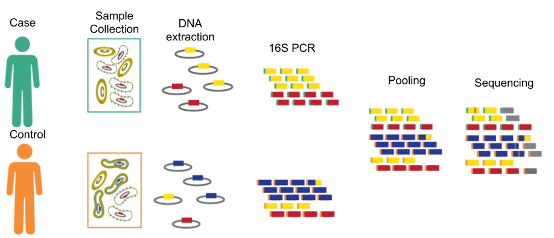

# Measurement Process and Assessment. {#measurement-process-assessment}

```
 + Defining the measurand, what is being measured
  - 16S rRNA sequencing has multiple measurands
  - After the measurand is defined the process used to quantify the measurand can be assessed.
+ Steps to measurement process assessment
  1. Decompose measurement process
  1. Design experiments to isolate measurement process elements
  1. evaluate bias and dispersion at each element
  + steps 2 and 3 require samples with known characteristics
+ 16S rRNA assessment studies evaluate steps of the measurement process using multiple measurands.
+ Value of a measurand first approach
+ In this chapter I will provide an overview the measurement process ...
```

## Measurement Process {#measurement-process}

The 16S rRNA marker-gene survey measurement process includes a number of laboratory and computational steps (Fig. \@ref(fig:measurementProcessLab) and  \@ref(fig:measurementProcessComp)).
In this section, I will provide an overview of the measurement process, and highlight significant known sources of error and dispersion (Fig. \@ref(fig:cause-effect)).
See @Goodrich2014 for a review of 16S rRNA marker-gene survey measurement process and general recommendations for conducting microbiome experiments.


```{r cause-effect, echo=FALSE, fig.cap = "Cause-effect diagram for the 16S rRNA sequencing measurement process. Causes of bias and variability are indicated as branches, e.g., cell type, and different sources of error are indicated by branch labels, e.g., storage conditions.", message = FALSE}
library(qcc)
cell_bias <- c("Storage","DNA extraction")
amp_bias <- c("PCR Primers", "Cycling Conditions")
seq_error <- c("Polymerase","Seq Rxn","Rxn Monitoring","Base Calling")
otu_inflation <- c("Variable Region", "Seq Error","Chimera")
coverage <- c("Normalization", "DNA Quant")

cause.and.effect(
  cause = list("Cell Type" = cell_bias,
               "Amplification" = amp_bias,
               "Feature Inflation" = otu_inflation,
               "Uneven Sampling" = coverage),
  effect = "Count\nTable")

```


The 16S rRNA gene is used for marker-gene surveys as it is found in all prokaryotic organisms, including both bacteria and archaea and contains hypervariable and conserved regions.
The conserved regions allow for the use of PCR primers which can amplify the 16S rRNA gene from diverse taxonomic groups [@Martinez-Porchas2017-pi; @klindworth2012evaluation].
Whereas hypervariable regions, allow genus and sometime species-level taxonomic classification.
Additionally, as the 16S rRNA gene is well studied there are several extensive well-curated databases, e.g. SILVA, RDP, and Greengenes [@quast2012silva; @McDonald2012-ro; @Cole2014].
There are drawbacks to using the 16S rRNA gene as well.
Due to the conserved nature of the gene, sequences cannot be used for the strain-level taxonomic classification required for some applications, such as pathogen detection and identification [@janda200716s].
Additionally, 16S rRNA is a multicopy gene that is known to be horizontally transferred between organisms, as a result, the within-genome 16S rRNA gene copy diversity can be greater than the between-genome diversity for some genera [@pei2010diversity].


```{r measurementProcessLab, echo = FALSE, fig.cap = "Diagram of the 16S rRNA marker gene survey measurement process for a simplified example study comparing case and control treatment groups. Samples are first collected from study participants. Colored boxes contains the true microbial community composition indicated by cartoon cells. The different cell walls and 16S rRNA sequence (grey oval with colored bar) indicate distinct biologically relevant units. Next, DNA is isolated from the other cellular material. Extraction efficiency differences are indicated by differences in the number of red, yellow, and blue bars relative to the sample numbers. PCR is used to target the 16S rRNA gene. Amplification efficiency biases shown as differences in the proportion of red, yellow, and blue PCR products from the DNA extract. Unique sample barcodes added during PCR are indicated as teal and orange bars on PCR amplicons. Chimeras, a PCR artifact, are shown as half blue and yellow PCR products. Sequencing libraries are produced by _Pooling_ PCR products from the two samples. Uneven pooling can result in the under-representation of a sample (teal in this example) in the sequence dataset. The resulting libraries are sequenced, sequencing artifacts are indicated as grey reads, for failed sequences, and grey vertical lines for single base sequencing errors."}

```

```{r measurementProcessComp, echo = FALSE, fig.cap = "Diagram of the 16S rRNA marker gene survey measurement process computational steps. Pre-processing assigns sequencing reads to samples using the unique barcodes and removes low-quality reads as well as filters chimeras. Feature inference is used to group the pre-processed reads into biologically relevant units. Sequencing errors can result in spurious features if not assigned to the source feature. The yellow and blue sequences with a grey vertical line are spurious features. Finally, taxonomic assignment is performed as part of feature annotation. Spurious features can be assigned to the wrong organism, yellow bar with grey line, or be unassigned, blue bar with grey line."}

```


For the measurement process, laboratory component raw sequence data are generated from environmental samples (Fig. \@ref(fig:measurementProcessLab)).
Samples are initially collected and stored to minimize changes to the community composition prior to sample processing.
Next, DNA is extracted from the sample, and the 16S rRNA is amplified using PCR.
Then PCR products concentrations are normalized, diluted to a standard concentration, to minimize between sample variability in the number of reads obtained per sample.
Finally, the normalized PCR products are pooled and sequenced.
Preferential DNA extraction and PCR amplification are two of the largest sources of bias in the measurement process (Fig. \@ref(fig:cause-effect)).
Other sources of error introduced at this point include PCR artifacts such as amplification errors (point mutations) and chimeras, sequence contaminants, and sequencing errors.
Computational methods correct for PCR artifacts, contaminant removal, and sequencing error correction.
Currently, there are no computational or laboratory methods to correct for preferential extraction or amplification.


Computational methods, collectively referred to as the bioinformatic pipeline, convert raw sequence data into an annotated count table for use in downstream analysis (Fig. \@ref(fig:measurementProcessLab)).
Bioinformatic pipelines use the same general approach, though the methods and order of individual steps vary by pipeline.
The first step is pre-processing the raw reads.
Pre-processing includes initial quality control steps, preparing reads for feature inference.
Next, feature inference is performed, grouping pre-processed into biologically relevant units.
Finally, feature annotation is used to obtain information about feature taxonomy and phylogenetic relatedness.
Biases introduced by the computational methods are either due to failure to correct for biases from the laboratory component or errors in feature annotation.

```{r downstreamAnalysis, echo = FALSE, fig.cap = "Diagram of 16S rRNA marker gene survey differential abundance and biological diversity downstream analysis methods. Differential abundance is a row-wise operation comparing feature abundance between treatment conditions with log fold-change (logFC) estimates calculated for each feature. Alpha ($\\alpha$) diversity is a column-wise operation where a single value is calculated per sample. Beta ($\\beta$) diversity is a row- and column-wise operation, with a single value calculated for each sample pair, using paired feature information."}

```

The annotated count table is then used in feature-level and community-level downstream analysis (Fig. \@ref(fig:downstreamAnalysis)).
Differential abundance is the most commonly used feature-level analysis.
Differential abundance is used to estimate feature relative abundance between treatments [@paulson2013differential].
Alpha- and beta-diversity analyses are the most commonly used type of community analyses.
Alpha-diversity metrics are numeric summaries of individual samples, including richness, evenness, and phylogenetic diversity metrics.
Beta-diversity is a measure of sample similarity and is used to compare feature presence-absence or incorporate relative abundance and phylogenetic relatedness.

## Feature Inference and Normalization {#feature-inference-normalization}

The following section provides additional details about the feature inference and computational normalization methods that are the focus of the assessment framework presented in this disseration.
Feature inference is used to group sequences into features that are representative of biologically relevant units.
Computational normalization is used to reduce biases in downstream analysis due to differences in total abundance between samples.
The feature inference process should maximize the number of features representing true sequences while minimizing the number of features representing sequence artifacts.
The two primary feature inference method types are distance-based clustering and sequence inference.


Distance-based feature inference methods cluster sequences based on defined similarity thresholds.
These clustering thresholds are based on taxonomic group sequence diversity and sequencing error (e.g., 99% species level, 97% genus level, 1% error rate).
Though studies characterizing within species and genera 16S rRNA sequence diversity [@pei2010diversity], and sequencing error rates [@Huse2010; @Schirmer2015; @Amore2016] challenge the validity of these values [@edgar2017updating].


There are three approaches to distance-based clustering, _de novo_, closed-reference, and open-reference.
For _de novo_ clustering, the pre-processed sequences are clustered based on the desired threshold.
For closed-reference clustering, the sequences are assigned to reference sequences based on the defined similarity threshold.
The reference sequences are sequences from a reference database previously clustered at the desired threshold.
Open-reference clustering combines _de novo_ and closed-reference clustering.
Reads are first clustered using closed-reference clustering then reads not assigned to reference clusters are clustered _de novo_.
A limitation of distance-based feature inference methods is the use of a defined similarity threshold.
Sequence inference methods were developed to avoid having to define such thresholds.


Sequence inference methods, another type of features inference, use statistical models or heuristic algorithms to infer the true biological sequence from which a read was generated.
By inferring the true biological sequence, this method avoids having to define an arbitrary threshold for grouping sequences.
DADA2, a sequence inference method, uses a probabilistic model and an expectation-maximization algorithm to test whether less abundant sequences are derived from higher abundance sequences [@callahan2016dada2].
DADA2 is the only sequence inference method to consider base quality scores.
DADA2 is computationally expensive on a per sample basis, though scalable as individual samples can be run in parallel.
Other sequence inference methods use heuristics, reducing the method the computational cost.
Similar to DADA2, UNOISE2 uses a model to assign lower abundance sequences to higher abundance sequences [@edgar2016unoise2].
However, UNOISE2 uses a single function with parameter values set using training data.
UNOISE2 significantly reduces the computational cost by using model parameters defined _a priori_, eliminating the need for the expectation-maximization step.
Deblur proportionally assigns lower abundance sequences to higher abundance sequences using estimates for the number of lower abundance sequences that are error derived sequences [@Amir2017].


After feature inference, the resulting count tables are normalized prior to use in downstream analysis.
Count table mormalization methods minimize biases due to differences in the total feature abundance between samples.
Variability in total feature abundance is due to differences in the number of reads generated per sample, and the proportion of sequences passing quality filtering.
There are two types of normalization methods rarefaction and scaling.
Rarefaction has its roots in ecology, where it is used to normalize sampling intensity per survey area [@Gotelli2001; @Hughes2005].
To rarify counts, individual sample counts are randomly subsampled, without replacement, to a user-defined level and samples with total abundance values less than the rarefaction level are dropped.
Scaling methods normalize count table values by sample-specific normalization factors.
For total sum scaling (TSS), and cumulative sum scaling (CSS), sample counts are divided by the sum of feature counts to a defined abundance percentile, 0.75 for CSS, and total abundance for TSS (proportions) [@paulson2013differential].
Other commonly used normalization methods include relative log expression (RLE), trimmed mean of M values (TMM), and upper quartile normalization [@Robinson2010; @McCarthy2012].
These methods were developed for normalizing microarray and RNAseq data but have been successfully used to normalize 16S rRNA marker-gene survey data [@McMurdie2014].

## Measurement Assessment Experiment Development 

```
+ General guidelines for developing an experiment to evaluate measurement process elements.
+ There are four parts to measurement assessment experiments consist of four parts
(1) define the measurand,
(2) identify part of the measurement process being assessed,
(3) determine assessment type, and
(4) identify appropriate data and metrics for the assessment.
```

When developing an assessment method, first define the measurand.
The measurand is the observed value being quantified.
For marker-gene survey analysis, there are multiple measurand definitions.
The measurand can be defined based on the downstream analysis, e.g., log fold-change for differential abundance analysis or diversity metric for alpha- and beta-diversity analysis.
The measurands can also be more general, such as count table values or feature DNA sequence.


After the measurand is defined, the next step is to determine the part of the measurement process one is interested in evaluating.
Assessments can compare the performance of different methods used in individual steps of the measurement process, for example, DNA extraction or PCR.
Assessment methods can also evalute part of the measurement process, such as the computational or laboratory components.
Alternatively, one can assess the measurement process as a whole.
The part of the measurement process being evaluated defines the experimental design used to generate the assessment dataset.


Next, one must determine the measurement assessment type.
The one assessment type is measurement process performance, or how well-observed values agree with expected results.
To evaluate sequencing error rates, @Schirmer2015 used a mock community of 59 strains and compared the observed sequence data to 16S rRNA sequences from  genome sequence data for the 59 strains.
@Schirmer2015 evaluated the impact of different laboratory protocols and pre-processing methods based on sequencing error rate reduction.
An assessment can also evaluate the impact of different protocols and computational methods on downstream analysis.
For example, to evaluate the performance of different normalization methods on differential abundance methods, @McMurdie2014 simulated feature differential abundances by perturbing count table values to have defined effect sizes between treatment and control conditions.
Additionally, assessments can evaluate measurement repeatability and reproducibility.
Interlaboratory studies are an example of this assessment type where multiple laboratories process the same set of samples or dataset using either the same or different protocols.
The microbiome quality control (MBQC) is an example of this assessment type [@Sinha2017-ew].
For MBQC, sets of replicate samples were sent to the participating laboratories for sequencing.
The resulting sequencing data were made available for the participants, as well as others, to process using different computational methods.


After defining the measurand, the part of the measurement process being evaluated, and assessment type, appropriate data and metrics are identified.
The primary data types used in marker-gene survey measurement assessment include _in-silico_ data, mock communities, and technical replicates.
Different parts of the measurement process and measurands can be assessed with different data types.
_in-silico_ data, either simulated sequence data or count tables, can be used to assess computational methods and downstream analysis.
Mock communities, either mixtures of DNA or cells, can be used to assess laboratory procedures, as well as computational methods.
Technical replicates are used to assess laboratory and computational method repeatability.
Once the measurand is defined, and appropriate data for assessment is identified, assessment is performed by comparing expected values to observed values.


Metrics used for assessment are dependent on the statistical properties of the measurand.
For quantitative measurands, such as count table values, relative error (the difference between the expected and observed values, normalized by the expected value) is commonly used.
For evaluating the linear relationship between observed and expected values a linear model can be used to estimate the overall agreement, $R^2$, and whether the relationship is 1-to-1, model slope.
Another metric for quantitative measurands, is signal-to-noise ratio, for example, with beta-diversity metrics, the ratio of beta-diversity between and within treatments or conditions.
For qualitative measures, such as feature presence-absence, standard truth table metrics, such as sensitivity and specificity can be used.
Similarly, area under the curve (AUC) and receiver operating characteristics (ROC) curves can be used to evaluate qualitative performance for a set of observed values.


### Example Measurement Assessment Studies
To evaluate sequencing error rates, @Schirmer2015 used a mock community of 59 strains and compared the observed sequence data to 16S rRNA sequences from  genome sequence data for the 59 strains.
@Schirmer2015 evaluated the impact of different laboratory protocols and pre-processing methods based on sequencing error rate reduction.
An assessment can also evaluate the impact of different protocols and computational methods on downstream analysis.

An assessment can also evaluate the impact of different protocols and computational methods on downstream analysis.
For example, to evaluate the performance of different normalization methods on differential abundance methods, @McMurdie2014 simulated feature differential abundances by perturbing count table values to have defined effect sizes between treatment and control conditions.

Interlaboratory studies are an example of this assessment type where multiple laboratories process the same set of samples or dataset using either the same or different protocols.
The microbiome quality control (MBQC) is an example of this assessment type [@Sinha2017-ew].
For MBQC, sets of replicate samples were sent to the participating laboratories for sequencing.
The resulting sequencing data were made available for the participants, as well as others, to process using different computational methods.


### Assessment using Mixtures of Environmental Samples
Limitations to using environmental samples and mock communities for measurement assessment can be addressed using mixtures of environmental samples.
Mixtures of environmental samples provide the complexity of real data regarding feature diversity and dynamic range with expected values for comparison.
Mixtures of environmental samples have previously been used to evaluate microarray and RNAseq methods [@irizarry2003exploration; @thompson2005use; @pine2011adaptable; @parsons2015using].
When used to assess marker-gene surveys, mixtures of environmental samples can be used to assess count table accuracy, differential abundance, and beta-diversity.
Simulated mixtures of environmental samples (simulated count tables) have previously been used to evaluate deferentially abundant features and beta diversity  [@McMurdie2014].


A limitation to using mixtures of environmental samples is the uncertainty in the expected values.
Expected value estimates are based on information from the unmixed samples and the mixture design.
Measurement values obtained for the unmixed samples are generally obtained using the same measurement process being assessed, and therefore, measurement uncertainty may not be well understood.
Using the same measurement process and technical replicates allows for the quantification of the measurement uncertainty, but provides no information about potential measurement biases.
In addition to uncertainty in the unmixed sample values, there may be uncertainty in the mixture design, both of which can be estimated.
For RNAseq studies, since the sequencing assay targets mRNA, the proportion of mRNA in the RNA extract needs to be accounted for in the mixture equation [@parsons2015using].
Similarly for 16S rRNA marker-gene surveys, as the PCR assay targets prokaryotic DNA, the proportion of prokaryotic DNA in the sample should be characterized and taken into consideration.


<!-- ## Example Assessments
- Feature inference assessment using mock communities
 * Type of data used
   + Mock communities
 * Methods
   + Expected number of features
   + Relative abundance comparisons
 * Example assessment(s)
   + Expected feature number
     - Clustering methods have also been evaluated based on the number of predicted OTUs relative to the number of expected OTUs (Huse et al. 2010, Kopylova et al. (2014)).
     - Here either simulated or data from a mock community, where the number of OTUs is based on the number of strains or genomes used to generate the assessment dataset.
   + Relative abundance
     - Brooks et al. (2015) generated 80 mock communities using different combinations of 7 bacterial strains generating mixtures of cells, DNA, and PCR products to characterize the contributions of different steps in the measurement process. Evaluated the results using a mixed effect model.
     - Schirmer et al. (2015) using a mock community of 59 strains (49 bacteria and 10 archaea) evaluated different sequence processing methods and parameters for read filtering and quality trimming, merging paired end reads, and error correction. Methods were evaluated based on error rate reduction.
 * Limitations and gaps
   + Relatively simple communities not representative of diversity and relative abundance dynamic range observed in environmental samples.
   + The limitation to this approach for feature number is that it does not account for contaminants when in vitro mock communities are used, and neither in silico or in vitro datasets represent the true complexity and diversity of environmental samples.


- Feature inference assessment using environmental samples
 * Type of data used
   + technical replicates of environmental samples
 * methods
   + Feature stability
   + Pairwise distances consistent with threshold definition
   + Benchmarking: comparing features between methods
 * Example assessment(s)
   + Feature stability
     - Cluster Robustness is another attribute for evaluating clustering methods (Y. He et al. 2015).
     - Cluster robustness can also be evaluated based on threshold and 16S region (Schmidt, Matias Rodrigues, and Mering 2015).
     - Cluster method robustness can also be calculated using cross validation(W. Chen et al. 2013).
   + Pairwise distances
     - Schloss (2016) argues that using simulated and mock communities is not representative of real environmental samples. The authors additionally, argue the approach used by Kopylova et al. (2014) to evaluating clustering methods confounds the impact of read filtering with clustering methods.
     - DNACluster clustering algorithm employs a heuristic based on a proof that for any given cluster the distance between two sequences in the cluster is less than the defined threshold value and no sequence is closer to another cluster center than the center of the cluster it is assigned to (Ghodsi, Liu, and Pop 2011).
   + Benchmarking
     - For environment datasets the clustering methods were evaluated based on the dissimilarity of samples for a dataset based on the sum of the squared deviation for UniFrac PCoA (Procrustes M2) and similarity to UCLUST (Pearson’s correlation).
 * limitations
   + No expected value for comparison
   + Pairwise distance dependent on how distance is defined


- Normalization assessment using _in-silico_ data
 * In the context of downstream analysis
 * Data
   + Simulated count data
 * Methods
   + Impact of normalization on expected results for downstream analysis
     - differential abundance
     - beta diversity
 * Example assessment(s)
   + McMurdie and Holmes (2014) compared differential abundance detection methods in conjunction with different normalization methods
     - Simulated OTU differences for read datasets by perturbing OTUs to have defined effect sizes between treatment and control conditions.
   + Weiss 2017
 * Limitations
   + Only evaluate normalization and downstream analysis
   + Not evaluating normalization and downstream analysis independently
 * Alternatives
   + Paulson - environmental samples -->

<!-- * Multiple measurands
for some definitions, single measurand per sample (alpha diversity), multiple measurands per sample (count table values), multiple measurands per dataset (feature DNA sequence), single measurand per sample comparison (beta diversity), multiple measurands per condition comparison (differential abundance). -->

 <!-- Once the measurand, measurement process component, and assessment type are determined an appropriate measurement assessment method can be identified.
   + Measurement assessment methods comprise two components data and a metric.
   + Data provide an expected measurand.
   + Observed value obtained after the data is processed by the measurement procedure.
   + Metrics are used to quantify how observed value agree with the expected values. -->

<!-- -   Next the resulting features are annotated with taxonomic and phylogenetic information.
 * The features taxonomy is determined by comparing the feature sequence to a reference sequences with known taxonomy.
   + There are three primary 16S rRNA reference databases, Greengenes, RDP, and SILVA that vary in composition, taxonomic system used, and format.
   + Using different databases has been shown to impact classification results.
   + Taxonomic classification methods generally fall into three categories, k-mer based, sequence alignment, and phylogenetic placement.
   + Methods vary in accuracy and speed.
 * Feature phylogenetic relationships are used in downstream analysis including some alpha- and beta-diversity metrics.
   + Phylogenetic trees are constructed using pairwise sequence distances obtained from multiple sequence alignments.
   + Phylogenetic tree construction methods bayesian, neighbor joining, maximum likelihood.
   + Impact of phylogenetic tree construction on downstream analysis ...
 * Closed reference clustering - reference trees and taxonomic assignment -->


<!-- Data type focused assessment outline
- Assessment using _in silico_ data
  * Simulated sequence data - post sequencing
  * Count table - post count table
  * Example use cases
    + Clustering
    + Differential abundance
    + normalization
      - beta diversity
- Assessment using mock communities
  * Whole cells - challenge measurement process post sample collection
  * DNA - measurement process post DNA extraction
  * Clustering - number of features
  * Relative abundance
  * sequencing errors and error correction/ error mitigation
  * limited number of organisms and dynamic range limits applicability
    * not used to assess differential abundance or beta diversity
- Assessment using technical replicates
  * Depending on the type of replicates - full measurement process
  * Only used for benchmarking, no expected value
  * Assessment approach
    + relative abundance comparison
    + beta diversity
  * Example use cases
    * Sample processing
    * Bioinformatic pipelines
- Assessment using mixtures of environmental samples
  + Complexity of real data with expected value for comparison
  + Previous uses - RNAseq and microarray
  + Suitability for marker-gene surveys
    * similar to previous studies using simulated count tables with differentially abundant features
  + Can be used to assess count table accuracy, differential abundance, and beta diversity.
  + limitation - uncertainty in expected value
    * Highlight issue with differences in bacterial DNA proportions
  -->

<!-- Wet Lab Measurement Process details
  + Sample collection and storage
    1. microbial composition is representative of the environment being sampled and does not change from collection to sample processing.
  + DNA extraction
    1. The genomic material, DNA, is isolated from the sample using DNA extraction.
    2. Biases and Error
      * DNA from different cell types, depending on cell wall composition, can be preferentially extracted from the material, skewing the microbial community composition.
      * Reagent contaminants result in spurious features.
    3. Limiting analysis to samples processed using the same extraction method limits the negative impact of these biases on the studies.
  + PCR amplification
    1. The 16S rRNA gene is selectively amplified using PCR, where PCR primers are used to target and amplify the desired region of the 16S rRNA gene.
      * The 16S rRNA gene has a number of conserved and variable reg ions.
    2. bias and error
      * Preferential amplification has been observed due to variation in the primer binding regions.
      * Sequence artifacts are introduced during amplification including single based variants and chimeras.
        * Chimeras are the product of one 16S rRNA molecule acting as a primer during amplification for an unrelated molecule.
    3. Feature inference and feature filtering, including chimera checking, are used to remove sequence artifacts from the processed data.
      * Currently no methods currently available for account for preferential amplification.
      * Data are more reproducible and therefore comparable if the same PCR protocol, primers, reagents, cycling conditions, are used, similar to DNA extraction and sample collection.
  + Library Prep
    1. Unique sample barcodes and adapter sequences are added to PCR products with a second PCR reaction.
      * Single PCR protocols are also commonly used.
      * Sample concentration is normalized to minimize the variation in the number of reads generated per sample.
      * Samples are pooled prior to sequencing.
    2. bias and error
      * Second PCR can introduce additional sequence artifacts
      * Poorly normalized samples can result in large variability in the number of reads obtained per sample.
  + Sequencing
    1. The library of pooled PCR products are sequenced where biochemical reactions are monitored.
    2. Sequencing errors
    3. Error correction, feature inference, and feature filtering is used to remove sequences that are not representative of true biological sequences.
-->

<!-- infrastructure
## Infrastructure
- Data formats
  * Experimental Data
    + Biom
    + QIIME2
    + R - MRexperiment, phyloseq
    + Pipeline specific file formats  - mothur
  * 16S rRNA databases
- Data format limitations
- Data format requirements
-->

<!-- Bioinformatic pipeline
- Bioinformatic pipelines include four main steps, (1) pre-processing, (2) feature inference, (3) post-processing, (4) feature annotation.
  * Pre and post-processing include quality control steps.
  * The individual steps employed, order steps are performed, algorithms used, and parameters vary by pipeline.


- Pre-processing is used to prepare the raw sequence data for feature inference and includes a number of quality control steps.
  * The raw reads are first filtered and trimmed based on base quality score information provided by the sequence platform.
  * For paired-end sequence data forward and reverse reads are often merged at this point.
  * As an additional quality control, the Mothur pipeline, aligns quality filtered and merged reads to a reference alignment prior to feature inference.
    + Reads failing alignment and gaps in the multiple sequence alignment are excluded from feature inference.
  * The processed reads are then used for feature inference.

- Post-processing is used to filter features that are artifacts of the 16S rRNA and sequencing process.
  * Chimeras are detected by comparing the ends of features to other features in a dataset or a reference database.
  * Features with the two ends of the sequence matching to different sequences are identified as chimeras and excluded from the count table.
  * Multiple sequence alignment, where features are aligned to a reference alignment is used to filter features that are sequence artifacts.
  * The assumption is that features that are not similar enough to align to the reference alignment are not 16S rRNA sequences but artifacts of the measurement process.
  * A third post-processing step is singleton and prevalence filtering.
  * For singleton filtering features representing only a single sequence are excluded from the dataset, as these are likely artifact sequences.
  * For prevalence filtering features present in less than a user defined threshold of samples are excluded from the dataset.
-->
